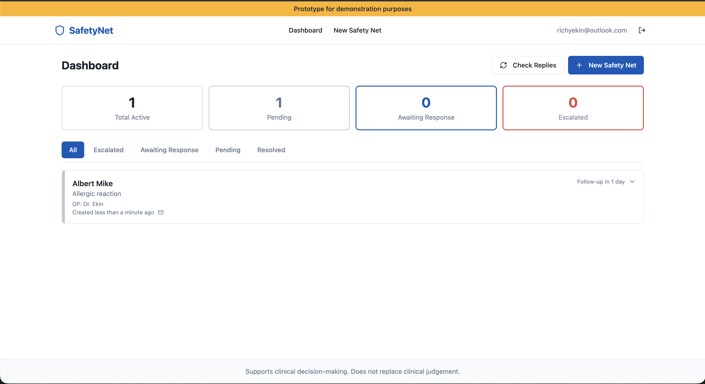

# SafetyNett

[](https://github.com/Ekin-Kahraman/safetynett/actions/workflows/ci.yml)
[](LICENSE)
[](https://safetynett.lovable.app)
[](https://clinicalhackathon.com)

**[Architecture](#architecture) | [Clinical Coverage](#clinical-coverage) | [Why This Matters](#why-this-matters) | [Roadmap](#post-hackathon-in-development) | [Tech Stack](#tech-stack) | [Team](#team)**

Every GP in the NHS gives the same instruction: *"Come back if you're not better."* Most patients don't come back. They deteriorate at home, misread their own symptoms, or simply forget. Safety netting — the clinical process of ensuring patients know when to seek further help — is verbal, untracked, and fails silently.

SafetyNett closes that gap. GPs create condition-specific safety nets at the point of care. The system contacts patients automatically after a set interval, collects their response, and uses AI to analyse whether their symptoms indicate clinical deterioration. If the AI detects red flags, the GP is escalated immediately with the patient's own words and a severity assessment.

**Live:** [safetynett.lovable.app](https://safetynett.lovable.app)

Built in 2.5 hours at the [OpenClaw Clinical Hackathon](https://clinicalhackathon.com) (28 March 2026, Accurx HQ, London).



## Architecture

```
GP creates safety net ─→ Timer expires ─→ Patient contacted (email / voice)
                                                    │
                                              Patient responds
                                                    │
                                          AI analyses response
                                           against condition-specific
                                           red flag criteria
                                                    │
                                    ┌───────────────┼───────────────┐
                                    ▼               ▼               ▼
                               No red flags    Red flags        No response
                               → Resolved      detected         → Escalate
                                               → Severity       (non-response
                                                 scored           is clinical
                                               → GP escalated     signal)
```

The AI doesn't pattern-match keywords. It reads the patient's natural language response, understands clinical context for that specific condition, and determines whether the described symptoms meet escalation criteria. A parent writing *"she won't drink anything and she's really floppy"* triggers escalation not because of string matching but because the AI recognises fluid refusal and reduced consciousness in a febrile child as clinically dangerous.

## Clinical Coverage

39 conditions across 9 specialties. Red flag definitions sourced from NICE Clinical Knowledge Summaries and NHS 111 pathway documentation.

| Specialty | Conditions |
|---|---|
| **Paediatrics** | Viral URTI, bronchiolitis, croup, febrile convulsion, meningitis |
| **Respiratory** | CAP, asthma exacerbation, PE, COPD exacerbation, suspected lung malignancy |
| **Cardiology** | ACS, heart failure, AF, pericarditis, aortic dissection |
| **Gastroenterology** | Appendicitis, pancreatitis, upper GI bleed, IBD flare |
| **Neurology** | Concussion, migraine, SAH, first seizure, TIA |
| **ENT** | Tonsillitis, peritonsillar abscess, otitis media, epiglottitis |
| **Mental Health** | Acute suicidal ideation, psychotic episode, acute anxiety |
| **Musculoskeletal** | Suspected fracture, septic arthritis, cauda equina syndrome |
| **Dermatology** | Cellulitis, allergic reaction, necrotising fasciitis |

Each condition carries its own red flag set. Meningitis flags non-blanching rash, neck stiffness, photophobia, bulging fontanelle, altered consciousness. Cauda equina flags saddle numbness, bilateral leg weakness, urinary retention. The clinical logic is specific, not generic.

## Why This Matters

Safety netting is a solved clinical concept with inadequate digital infrastructure. NICE guidelines mandate it. The RCGP teaches it. Every GP does it verbally. Existing tools (EMIS templates, Ardens, SystmOne flags) are passive reminders — they don't contact the patient, collect a response, or analyse whether symptoms have progressed. There is no system that actively tracks whether the instruction was followed or whether the patient deteriorated at home.

This isn't a theoretical gap. NHS England stated in October 2024 that primary care should *"have information systems that automatically flag patient safety issues such as missed patient referral follow-ups, safeguarding, diagnoses and medication issues."* A [2022 JMIR framework](https://medinform.jmir.org/2022/8/e35726) for evaluating e-safety-netting tools concluded that **no tools currently available meet all the criteria**. Existing solutions (EMIS templates, Ardens, SystmOne flags) are passive reminders embedded in EHR systems — none actively contact the patient, collect a response, or analyse it.

SafetyNett is not a symptom checker. It doesn't diagnose. It automates the follow-up that GPs already give, makes it trackable, and escalates when patients describe symptoms that clinically warrant it.

## Post-Hackathon: In Development

### AI Verification Layer

The primary feedback from hackathon judges (NHS clinicians): automated systems contacting patients about clinical symptoms in a regulated environment carry risk. The right response is not removing AI — it's adding a verification layer.

A dedicated verification model reviews every outbound communication and every escalation decision before it reaches a patient or GP. The verifier checks:

- Whether the AI's clinical reasoning is sound for the specific condition
- Whether severity classification matches the described symptoms
- Whether edge cases (ambiguous language, multiple conditions, patient distress) are flagged for human review

This creates a dual-model pipeline: primary AI analyses the response, verification AI audits the analysis, human clinician intervenes where either model flags uncertainty. Designed for MHRA Software as a Medical Device (SaMD) classification and NHS clinical safety standards (DCB0129 / DCB0160).

### Voice Follow-Up (ElevenLabs)

Email excludes the patients who need safety netting most — older patients, patients with visual impairments, patients with low digital literacy. These are the same patients most likely to deteriorate without seeking help.

ElevenLabs voice synthesis delivers follow-ups as automated phone calls running simultaneously with email. The patient responds verbally; speech-to-text feeds into the same AI analysis pipeline. Same clinical logic, different channel. The GP's dashboard shows both email and voice responses in one view.

### Further Planned

- FHIR integration for NHS Spine connectivity (PDS patient lookup, GP Connect)
- Structured audit logging for CQC inspection readiness
- Multi-language patient communications
- GP-configurable custom red flag definitions

## Tech Stack

- **Frontend:** React, TypeScript, Tailwind CSS, shadcn/ui
- **Backend:** Supabase (PostgreSQL, auth, edge functions)
- **Email:** OpenMail API
- **Deployment:** Lovable Cloud

## Project Structure

```
src/
├── components/       Dashboard, safety net cards, forms, navigation
├── hooks/            Auth, toast, mobile detection
├── integrations/     Supabase client and types
├── lib/              Clinical logic — conditions, red flags, timeframes
├── pages/            Dashboard, create safety net, login
supabase/
├── migrations/       Database schema
├── functions/        Edge functions (trigger-followup, process-response)
```

## Usage

The app runs at **[safetynett.lovable.app](https://safetynett.lovable.app)**. All backend logic (auth, database, edge functions, email dispatch) runs on Supabase Cloud — there is no self-hosted mode.

For local development (modifying the frontend):

```bash
npm install
npm run dev
```

Requires `.env` with Supabase and OpenMail credentials pointing to the cloud instance — see `.env.example`.

## Limitations

Hackathon prototype. Supports clinical decision-making — does not replace clinical judgement. AI verification layer and regulatory compliance work are in active development.

## Team

Built by a team of five at the OpenClaw Clinical Hackathon. Clinical logic authored from NICE Clinical Knowledge Summaries and NHS 111 pathway documentation.

## Licence

MIT
